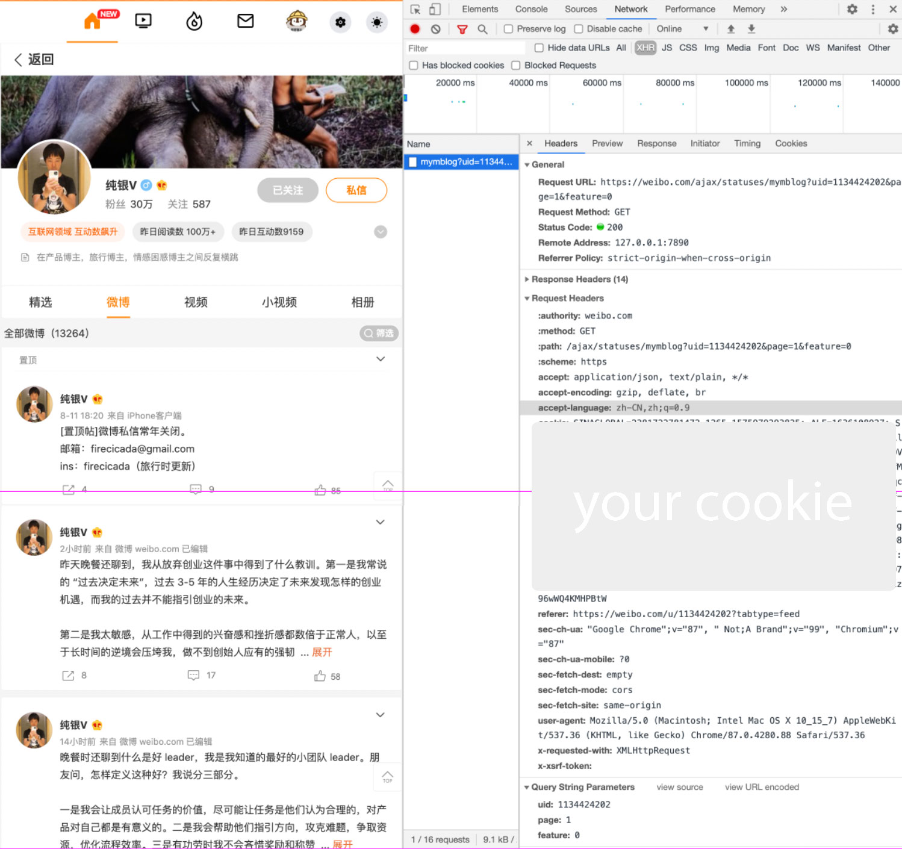
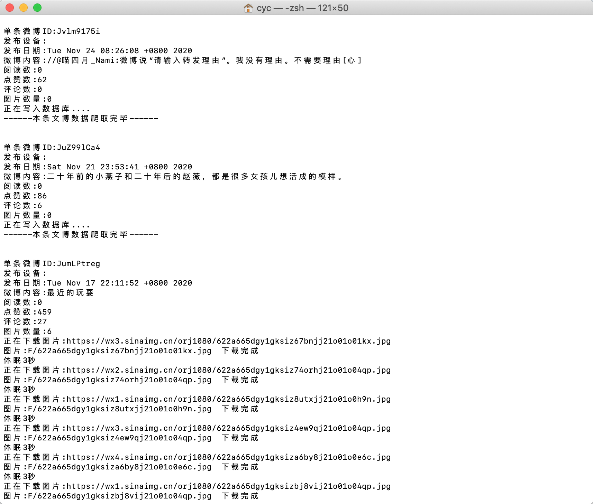

# weibo_backup
微博流接口: https://weibo.com/ajax/statuses/mymblog?uid=1134424202&page=1&feature=0 直接解析json就得到完整的数据了

## config.php
userid => 爬取的用户id  
total => 总微博数 由于接口没有返回这个字段 手动配置下吧  
per => 每页的微博数据条数  
pic => 图片保存到同一个文件夹下 或者 每个微博一个文件夹  
header => 登录微博获取，需要配置下自己的Cookie和token（注意得删除请求头中accept-encoding: gzip, deflate, br 这个字段）  
  
剩下选项的配置文件有注释  

## 使用
cli模式下  
php run.php

## 运行截图
  

## 说明
这个好像只能爬到原创微博，由于我拿来备份自己原创微博数据了，转发的微博字段不一样我没做分析。然后想爬评论什么的看下微博请求的接口就行了，json返回的很详细。
